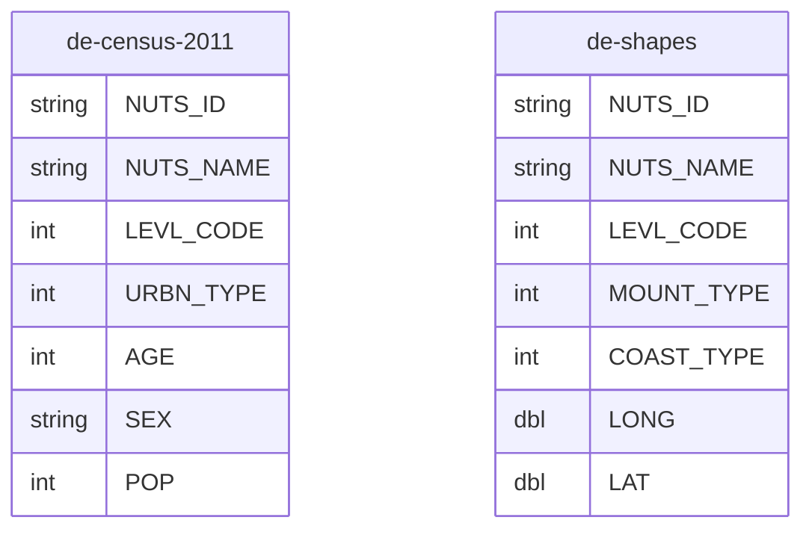

# Data

Entity Relationship Diagram (ERD) was generated using Mermaid.

```mermaid
erDiagram
  de-census-2011 {
    string NUTS_ID
    string NUTS_NAME
    int LEVL_CODE
    int URBN_TYPE
    int AGE
    string SEX
    int POP
  }

  de-shapes {
    string NUTS_ID
    string NUTS_NAME
    int LEVL_CODE
    int MOUNT_TYPE
    int COAST_TYPE
    dbl LONG
    dbl LAT 
  }
```